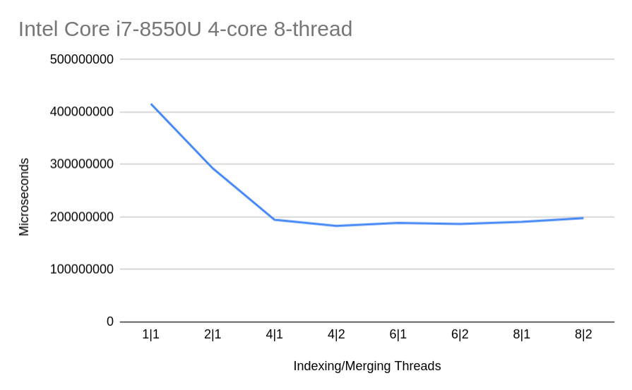

# Word Indexer

An implementation of a parallel word indexer program in Rust.

### Prerequisites
- [Rust](https://www.rust-lang.org/tools/install)

### Compilation

```zsh
$ cargo build --release
```

### Usage

```zsh
$ cargo run --release <path_to_config_file>
```

Or if there is an ```index.cfg``` file in the root directory of the project, you can use:

```zsh
$ cargo run --release
```

To run the program multiple times and get the min total time you can use the ```run.py``` scritp:

```zsh
./run.py <number_of_runs> <path_to_config_file>
```

Here is an example ```index.cfg```:
```
indir="data"          # Директорія для індексації
out_by_a="res_a.txt"  # Результати, посортовані за алфавітом
out_by_n="res_n.txt"  # Результати, посортовані за кількістю
indexing_threads=4
merging_threads=2
```

### Results

Chart for guttenberg_2020_03_06.iso directory 5:
